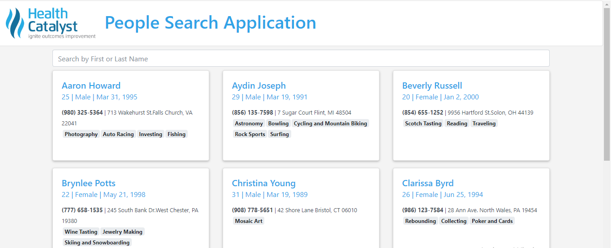
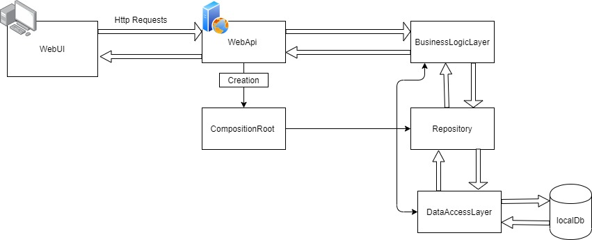

# HealthCatalyst-PeopleSearchApplication

### Business Requirements 

1. The application accepts search input in a text box and then displays in a pleasing style a list of people where any part of their first or last name matches what was typed in the search box (displaying at least name, address, age, interests, and a picture).  
2. Solution should either seed data or provide a way to enter new users or both. 
3. Simulate search being slow and have the UI gracefully handle the delay.

### Technical Requirements 

1. A Web Application using WebAPI and a front-end JavaScript framework (e.g., Angular, React, etc.)  
2. Use an ORM framework to talk to the database 
3. Unit Tests for appropriate parts of the application 

### Prerequisits to run
1. Clone or download the source code.
2. Make sure the path you clone or download the source code to is not __too long__, it will cause error for packages to install.
3. Make sure the path you clone or download the source code to has __write access__. 

### Technical Details
###### Major Projects:
1. HealthCatalyst.PSA.WebUI - Front end web application created using ASP.NET Web Application (.NET Framework) and AngularJs.
2. HealthCatalyst.PSA.WebAPI - Web Api created with ASP.NET Web API (.NET Framework).

* Used Entity Framework Code First Approach to create database on localDb.
* Used Ajax calls for making http requests.
* Testing performed with MSTest.
* Used Bootstrap 4 for UI design.
* Used Autofac for Registring Components and Resolving Services.

### Architecture

### Key Packages
1. EntityFramework
2. Autofac

### Tools 
1. Visual Studio 2019 Community Edition.

### Issues you may face while running the Application
1. Package errors because of the path of the project being too long. 
* Solution: Make sure the path to the project is short. Clean and build the solution and run.
2. Issue when running the api, you may face an issue that says `Could not find a part of the path … bin\roslyn\csc.exe`
* Solution: The Roslyn compiler comes from a NuGet package and there is/was a bug in some versions of that package.The solution is to reinstall/upgrade that package to a bug-free version. Run the following command in the Package Manager Console:`Update-Package Microsoft.CodeDom.Providers.DotNetCompilerPlatform -r`. Then clean and build the project before running.
